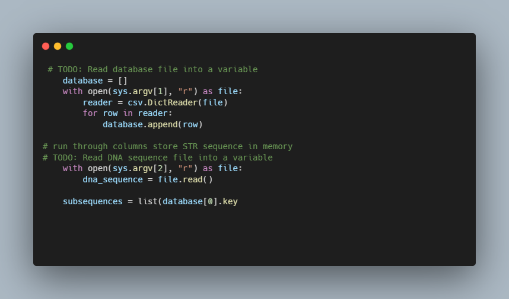

# DNA Python - CS50

### Description

A program that identifies a person based on their DNA.

given a sequence of DNA, how might you identify to whom it belongs? Well, imagine that you looked through the DNA sequence for the longest consecutive sequence of repeated AGATs and found that the longest sequence was 17 repeats long. If you then found that the longest sequence of AATG is 22 repeats long, and the longest sequence of TATC is 19 repeats long, that would provide pretty good evidence that the DNA was Bob’s. Of course, it’s also possible that once you take the counts for each of the STRs, it doesn’t match anyone in your DNA database, in which case you have no match.

In practice, since analysts know on which chromosome and at which location in the DNA an STR will be found, they can localize their search to just a narrow section of DNA. But we’ll ignore that detail for this problem.

Your task is to write a program that will take a sequence of DNA and a CSV file containing STR counts for a list of individuals and then output to whom the DNA (most likely) belongs.

### How to use

load database 

python dna.py data.csv squence.txt

You program should out put name of match, or no match.

### Code Snippet

### Links

For more information about DNA visit: 

---------------------------------
[cs50 course](https://cs50.harvard.edu/x/2022/psets/6/dna/)
---------------------------------------------------------------

